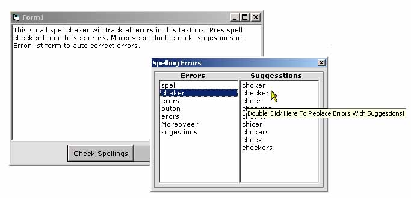



## Spell Checker \(OLE Word\)

### Description

This program uses Word's Dictionary to display errors in a text. It first creates a Word Application and then copies text to word. An Example of Ole Automation and VBA.
 
### More Info
 
This program opens an invisible instance of MS word. MS Word eats more than 28000 K of memory. Make sure the MS Word application is also unloaded after this program is unloaded otherwise it wont release your system resources. (You may use Task Manager CTRL+ALT+DEL to end MS Word at any tine to release resources.)

             |
---                |---
**Submitted On**   |2006-09-01 09:30:02
**By**             |[M\.Mehdi](https://github.com/Planet-Source-Code/PSCIndex/blob/master/ByAuthor/m-mehdi.md)
**Level**          |Intermediate
**User Rating**    |5.0 (15 globes from 3 users)
**Compatibility**  |VB 5\.0, VB 6\.0
**Category**       |[Microsoft Office Apps/VBA](https://github.com/Planet-Source-Code/PSCIndex/blob/master/ByCategory/microsoft-office-apps-vba__1-42.md)
**World**          |[Visual Basic](https://github.com/Planet-Source-Code/PSCIndex/blob/master/ByWorld/visual-basic.md)
**Archive File**   |[Spell\_Chec201708912006\.zip](https://github.com/Planet-Source-Code/m-mehdi-spell-checker-ole-word__1-66432/archive/master.zip)

